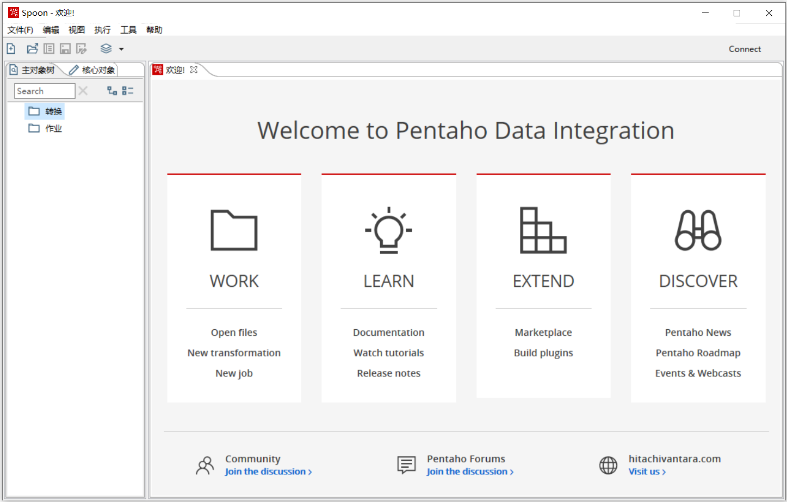

### task0 Kettle的下载安装

#### 1.下载安装 JDK
oracle 官网下载 [JDK1.8](https://download.oracle.com/otn/java/jdk/8u301-b09/d3c52aa6bfa54d3ca74e617f18309292/jdk-8u301-windows-x64.exe?AuthParam=1630918905_e6dbbfc00576b7ebdd2db47390ab4dd4) ，并安装，或者职教云资源中也可以。

#### 2. 下载Kettle软件包

从sourceforge下载完整 [Kettle](https://sourceforge.net/projects/pentaho/files/latest/download) 软件包，下载最新版本即可。也可以百度云下载

链接：https://pan.baidu.com/s/17IMMDWt-RG0X5q8cyySaKg 
提取码：na2p 
--来自百度网盘超级会员V3的分享

#### 3. 解压Kettle

把Kettle软件包解压，然后执行里面的Spoon.bat，出现如图所示界面即表示安装成功。

#### 4. 注意事项

1) 本来觉得最新的openjdk可以搞定，最后发现还是oracle官方jdk1.8搞定，1.9都不行。初步判断是9.0里面依赖的endores目录有问题，也可能是jre目录的问题，在解压版本的jdk里面没有单独的jre目录。所以还是老老实实的jdk1.8了。

