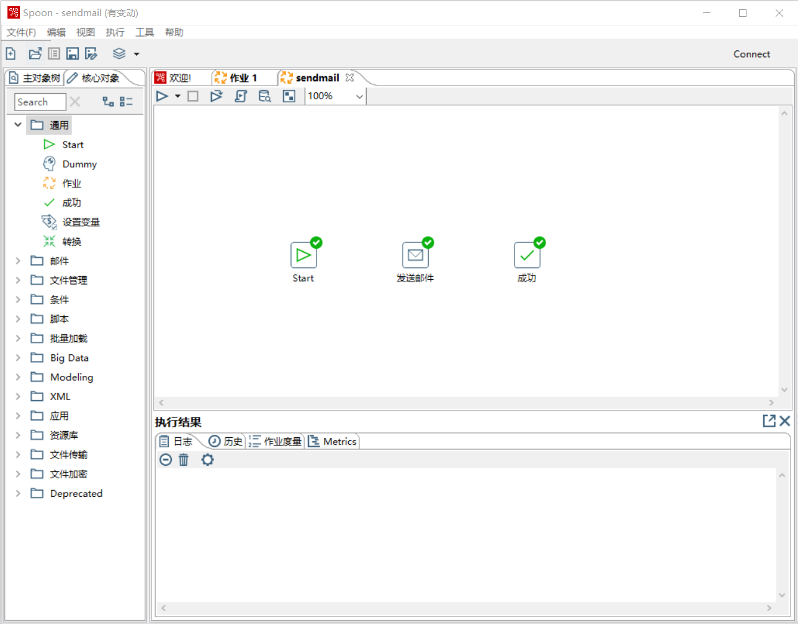
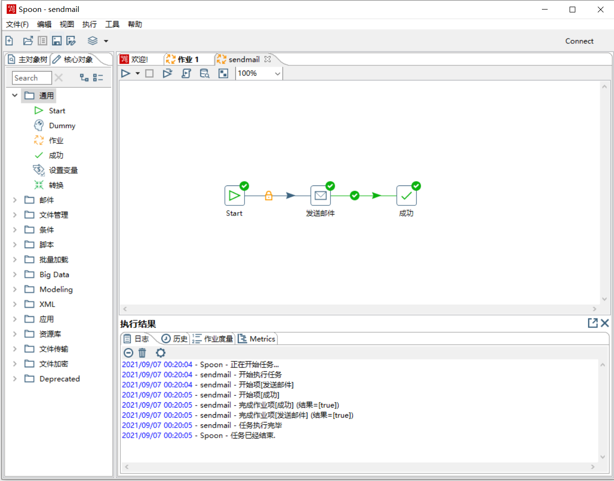

### task1 发送邮件

#### 1. 创建作业

打开Kettle工具，创建一个作业，名称为send_email，并从左侧核心对象里面拖动添加Start控件、“发送邮件”控件、“成功”控件以及作业跳连接线，具体如图所示。

#### 2. 配置Start控件

双击Start控件，可以配置作业的定时调度信息。

#### 3. 配置“发送邮件”控件

双击“发送邮件”控件，”收件人地址“填”67522134@qq.com"，“回复名称”填“哈哈哈哈哈”，“发件人地址”填“moocrenge@163.com"（填自己的，需要填密码），在”服务器“选项卡中，”SMTP服务器“填写”smtp.163.com“（看看自己邮箱有没有开启客户端连接，使用smtp发邮件的服务），”端口号“填”587“（支持SSL），”用户验证“选中，并填写用户名和密码，使用安全验证，验证方式为SSL。

#### 4.  连接作业对象

选中”Start“和”发送邮件“，然后右键，选择“新节点”，建立两者之间的连接。然后同样链接”发送邮件“和”成功“节点。最后执行，可以验证一下是否发送成功。结果如图所示。

